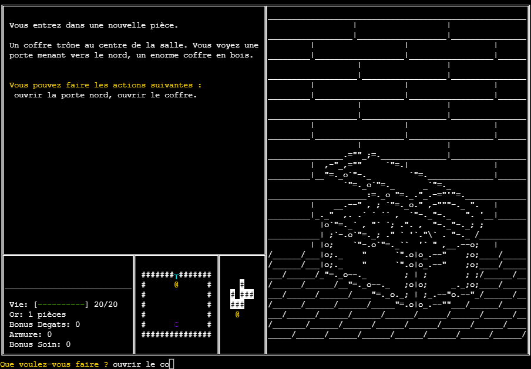

# Kartoffel-RPG
Website where you can try my first python project, a python ascii-art rpg: Kartoffel RPG!  
Try it here: https://raphaelchevasson.github.io/kartoffel-rpg/

# The Game
The python game consists of a single python file, `Kartoffel_RPG.py`, and several `.txt` ascii-art files, contained in `art/`.  
A french explanation of the project and code can be found in `Compte-rendu.pdf`.  
It was designed to work in both ubuntu terminal and windows cmd, and written with beginner-level python (no classes, no dependencies) for a 1st-2nd year school project.  

# The Website
To enable trying this game in your browser, I built a website using [xterm.js](https://xtermjs.org) for the front-end and [Skulpt](https://skulpt.org) as the python interpreter.  
By the way, Skulpt is the only python-in-browser solution that can do time.sleep() and don't weight 10MB, so kudo to them /o/  

# Screenshots
